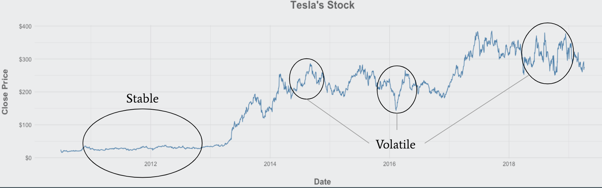

```{r setup, include=FALSE}
knitr::opts_chunk$set(echo = TRUE)
library(dplyr)
library(ggplot2)
library(kableExtra)
library(knitr)
```

# Overview
As partial fulfillment of the Master of Science degree in Mathematics (with a Statistics concentration) from the University of Nebraska - Omaha, a project with an academic and external advisor must be conducted. The project ought to use knowledge and skills learnt throughout the course of the program (in my case, statistics). 

For this project, Jeff Anderson, the Director of Business Solution Strategies at TDAmeritrade, was my external advisor. For the project, we decided that I would create a time series forecasting web application for stock closing prices. Since I would be working with time series data, I decided that I would work with Dr. Andrew Swift as my academic advisor. 

## Project Description
As defined through the project proposal form, this project was aimed to accomplish the following:

>Create a web application to allow the user to choose various forecasting methods on daily stock market closing prices and volume. The user will also be able to choose 15 minutes and 60 minutes real-time intervals rather than daily.

>The web application will also allow the user to compare the relationship between multiple stocks. The application will use multiple visualizations to allow the user to conduct exploratory data analysis. Also multiple forecasting methods will be offered to the user so that the user can see which method best fits.

>The application will be built using R (RShiny) for the server and user-interface side, and a Yahoo API for streamlining stock data.

As the application was being built out, the requirements shifted and the application included the following:

* Traditional stock graphs (i.e. time series line graph and candlestick graph)
* Generalized and usable for any stock on the New York Stock Exchange (NYSE)
* Automated ARMA+GARCH modeling of any stock on the NYSE for any date range as long as the beginning date was before 2008
* Popup text box to share with the user the ARMA+GARCH model that was chosen
* Manual capabilities of an user-defined ARMA+GARCH model
* Easy interpretability of forecasts
* Error bars arround the projected forecast of prices
* Downloadable table (i.e. downloadable .csv file) of actual stock prices and forecasts

To view the application, you can request the .R files from Dr. Swift in the Mathematics Department at the University of Nebraska - Omaha. You may also request the application and the appropriate .R files from Jordan Wheeler (via: jordanwheeler@outlook.com).

## Motivation
The project was designed with my academic background in thought. Since majority of my courses during my Masters of Science program dealt with statistical modeling (e.g. time series), data visualization, web application, and data science, we decided that creating a web application would demostrate the knowledge and skills I had gaine.

Aside from my academic background, I have been interested in integrating statistics and mathematical models within a application to allow the user to gain insight from my knowledge of statistics, modeling, and visualizations. There is also an increasing desire from society to integrate mathematical modeling in technology and a desire to automate and streamline the processes for users of the technology.

Lastly, since the data we are working with is financial and stock data from the NYSE it is publicly available to everyone. This means that this project and application can we shared for future purposes.

# Time Series
Time series is a special case of statistical modeling that models and understands data which is collected consecutively over time. Whether it is financial or stock prices, temperature or weather related values, sales of a business, biological and chemical processes, or even daily activity levels, we observe time series data everyday throughout life. 

Generally speaking, there are two reasons we are concerned with time series modeling. The first is to understand sequential data. This means that we are interested in identifying trends, seasons, and cycles within sequential data. The second reason is to forecast future values given the history. This allows us to make current decisions based on what is projected for the future. For example, we have seen this with carbon emissions. Given the historical and current data of climate and weather, we can forecast future values and we see that the future is quite concerning. We can use this information from the forecasts to make present decisions on lowering carbon emissions to try and reduce future harm of the environment.

There are several indicators which would tell someone that a time series model is appropriate given certain data. The most obvious indicators are that there is a time element which is apart of the data and that consecutive points or values are correlated with eachother. 

## Stock and Financial Data
For this specific project we are working with stock data. The best way to model stock data is through time series modeling. Even though it is quite obvious that stock data is a time series, we can see that the obious indicator from the previous paragraph apply. Stock data is reported on a timely basis, whether it is daily or intraday. It is also obvious that current stock's price does not start from 0 and then go up, it starts from the previous value. This would indicate that the current price is correlated with the previous price values.

However, it was decided in the 1980s by Dr. Robert Engle and Dr. Tim Bollerslev [@bollerslev_1986] that financial data should not be model using current time series methods. At the time current methods only modeled the condition mean of the data being model. This means that it did not take into account the previous variances of the model. However, Dr. Engle and Dr. Bollerslev noticed that financial data involved volatility clustering. Volatility clustering can be thought of the phenomenon where large flucuations (or high volatility) of a stock are typically followed by more large flucuations and small flucuations (or low volatility) of a stock are typically followed by small flucuations (see Figure 1). In other words, if a stock is volatile today, then it is likely to be volatile tomorrow, and it will eventually return to a calm and stable state. And if a stock is calm and stable today, then it is likely to be calm and stable tomorrow, and it will eventually return to a volatile state. 

```{r, echo=FALSE, out.width = '100%', fig.align='center', fig.cap="Shown here is Tesla (TSLA)'s stock from 2010 to 2018. Circle are areas which volatility clustering can be seen. Stable states are grouped together and volatile (big changes in prices) states are grouped together", fig.pos="H"}

```   

This volatility clustering concept sparked the motivation to come up with a new time series method where the mechanism models the variance given the previous variances. This idea was drawn out by Dr. Engle and he created a new type of time series model known as the Autoregressive Condition Heteroskedasticity (ARCH), which models the conditional variance of a stock [@engle_1982]. A few years later, Dr. Bollerslev developed a new model based off of the ARCH model. This model is known as the Generalized Autoregressive Conditional Heteroskedasticity (GARCH) model and it is used when the data (i.e. it's mean) follows an Autoregressive Moving Average (ARMA) model.

Since the development of the ARCH/GARCH models, financial data has been model using an ARMA+GARCH model. These models will be explained in the following subsections. It is important to note that the idea of the ARMA+GARCH model is that the ARMA part models the conditional mean of the stock (i.e. its value) and the GARCH part models the conditional variance of the stock.

## ARMA Modeling

As it was stated previously, the ARMA model forecasts the conditional mean of an entity. We define the ARMA model as [@cryer_chan_2011]:

\begin{equation}
Y_t = \phi_1 Y_{t-1} + \phi_2 Y_{t-2} + ... + \phi_p Y_{t-p} + e_t - \theta_1 e_{t-1} - \theta_2 e_{t-2} - ... - \theta_q e_{t-q}
\end{equation}

Breaking down the equation above, we have that $Y_t$ is the value of the entity (or stock) at time $t$. Also, we have that $e_t$ is the value of the error term at time $t$. Lastly, we have that $\phi\text{'s} \text{ and } \theta\text{'s}$ are constants of the value of the entity and the error of the entity. We then state that the ARMA model has two parameters $p$ and $q$, where $p$ is the number of lag conditional means and $q$ is the number of error terms. We then define an ARMA model by $ARMA(p,q)$

## GARCH Modeling

As it was stated previously, the GARCH model forecasts the conditional variance of an entity. We define the GARCH model as [@cryer_chan_2011]:

\begin{equation}
\sigma^2_{t|t-1} = \omega + \beta_1\sigma^2_{t-1|t-2}+...+\beta_p\sigma^2_{t-p|t-p-1} + \alpha_1r^2_{t-1} + ... + \alpha_qr^2_{t-q}
\end{equation}

In a similar fashion to the ARMA section, we will break down the above equation. First, we have that $\sigma^2_{t|t-1}$ is the conditional variance at time $t$ given the information up until time $t-1$. Also, we have that $r^2_{t-q}$ is the squared error term at time $t-q$ and $\sigma^2_{t-p|t-p-1}$ is lagged variance at time $t-p$ given the information up until time $t-p-1$. Lastly, we have that the $\omega, \beta\text{'s}, \text{ and }, \alpha\text{'s}$ are constants. We then state that the GARCH model has two parameters $p$ and $q$, where $p$ is the number of lag conditional variances and $q$ is the number squared error terms. We then define a GARCH by $GARCH(p,q)$.

## ARMA + GARCH Modeling
The ARMA+GARCH model uses the models from the above section meaning an ARMA+GARCH model is defined by $ARMA(p,q) + GARCH(p',q')$, where $p$ and $q$ are the parameters of the ARMA model and $p'$ and $q'$ are the parameters of the GARCH model. The ARMA+GARCH models the log returns of a stock or financial entity. This is an important distinction to make - we are not modeling the close price of a stock, rather, we are modeling the log of the return of a stock. The log return of a stock is defined by:

\[
Ret_t = log \bigg(\frac{Close_t}{Close_{t-1}}\bigg)
\]

Where, $Ret_t$ is the log return at time $t$; $Close_t$ and $Close_{t-1}$ is the closing price of the stock at time $t$ and time $t-1$.

This means when we make a forecast using an ARMA+GARCH model, it is the log return not the close price. Somehow we need to convert the log return into a close price. We will show this by example. Suppose we train an ARMA + GARCH model on the log returns from time $1$ to time $t$ (i.e. we are modeling the data $Ret_1$, $Ret_2$,..., $Ret_t$). Our first forecast will be $\hat{Ret}_{t+1}$. We will need to convert $\hat{Ret}_{t+1}$ into a forecasted close price, $\hat{Close}_{t+1}$. Using the definiton of a log return, we will get the forecasted closed price at time $t+1$ through the following steps:

\begin{equation*}
\begin{aligned}
&\hat{Ret}_{t+1} = log \bigg(\frac{\hat{Close}_{t+1}}{Close_{t}}\bigg) \\
\text{iff. } &e^{\hat{Ret}_{t+1}} = \bigg(\frac{\hat{Close}_{t+1}}{Close_{t}}\bigg) \\
\text{iff. } &\hat{Close}_{t+1} = e^{\hat{Ret}_{t+1}} * {Close_{t}} 
\end{aligned}
\end{equation*}

Therefore, the forecasted close price at time $t+1$ is the close price at time $t$ multipled by the (natural) exponential of the forecasted log return at time $t+1$.

For further information about the theory behind ARMA and GARCH modeling, refer to \textit{Time Series Analysis with Applications in R} by Jonathan D. Cryer and Kung-Sik Chang. 

# Application
With the advancement in technology within the past 20 years, the use (and dare I say neccessity) of applications has increased. Applications allow technology and content experts to put their skills and knowledge in the hands of users who may not possess those certain skills. 

Since forecasting heavily relies on a statistical and mathematical background, I can use my knowledge of these concepts to create models that will forecast the given data. This will streamline the statistical process for the user, which means the user will not need the knowledge of time series forecasting to create forecasts. However, the complication comes when I try to bridge the gap between my knowledge and a user who does not have the knowledge. The development of an application will act as this bridge, which will allow the user to easily interact with my statistical models and easily interpret the results.

## R Shiny
Throughout my academic pursuit at the University of Nebraska - Omaha, I have learned to use a statistical programming language called R. The language R allows users to easily explore, clean, visualize, and model data inputs. Built within the R language is a package called \textit{Shiny}. This package allows R users to create interactive web applications which can be shared with other users. It allows the R programmer to generalize its R code by accepting input values that interact with the outputs.

Majority of the application is built using R Shiny. However, I did use custom HTML (HyperText Markup Language), CSS (Cascading Style Sheets), and JS (JavaScript) to make style edits to my application. When building an application using R Shiny, you have two important parts, a User Interface (UI) side and a Server side. The UI side is used for the display, it is what the user of the application sees (visual component of the application). The Server side is used to take inputs from the interface (i.e. user), perform some sort of calculation, and provide an output, which is then displayed on the interface.

## Automated Modeling
Since the main purpose of the application is to build a bridge between statistical knowledge and a user with no statistical background, it is important to automate the modeling process. This automation has to be generalized so that it can be done for any stock and any date range given.

There are packages in R that automate the modeling process for other statistical models, however, there is no package that automates the modeling process for a ARMA+GARCH model. After some digging on the internet, I found a function written by Ivan Popivanov, a Microsoft Software Engineer, that automates the ARMA+GARCH modeling [@popivanov_2013]. Before blindly trusting Popivanov's automation process, I looked at the code to understand what was going on and determined that the process is sound.

It is important to understand the basics of the automation process by Popivanov. The basic idea is we will do a grid search method over the parameters for the ARMA and GARCH models. Focusing on the ARMA model, we have two parameters $p$ and $q$. For the grid we will search over the values $(0, 1, 2, 3, 4, 5)$. This means we will have a 6 by 6 grid of potential parameters for the ARMA model. For the GARCH side, we will hold the parameters $p'$ and $q'$ at 1, therefore we do not perform a grid search for the GARCH model. This means we will fight a total of 36 models everytime we automate the modeling process. We will then take those 36 models and compare their AICs to determine which model is the best for the given data.

## Prediction
This section is added due to an issue that occured while programming the application. With the ARMA+GARCH models, the standard prediction function outputs an error when trying to forecast more than 1 step out. To fix this issue, Dr. Swift provided me with his own custom prediction function that will not have an error when forecasting more than 1 step out for a ARMA+GARCH model. The prediction function not only provides the forecast, but it also provides the standard deviation of the forecast. This standard deviation can be used to show a confidence interval of the forecast, which is used to create error bars on the forecast in the output plots.

# Performance

Although the application will automatically create the "best" ARMA+GARCH model and provide forecasts, it does not necessarily mean that those forecasts are accurate. One way to measure our system's accuracy is to look at the forecasted price and compare it to the actual. However, since prices between steps of the data are generally closely related, the "accuracy" of each forecast will be relatively high. Therefore, we should also be interested if the forecast is predicting an increase or decrease.

To evaluate the model's accuracy, we will calculate two metrics: Accuracy of Forecast and Probability of Predicting True Increases/Decreases.

## Accuracy of Forecast

For the Accuracy of Forecast metric, we will train an ARMA+GARCH model using a window and then generate a forecast for the next day. Once we generate a forecast we will compare that forecast to the actual on that day by taking the absolute value of the difference between the actual and forecasted value (absolute percent error). We will then divide that absolute difference by the actual and subtract it from $1$, which will give us the accuracy.

\[
\text{Absolute Percent Error} = \frac{|(\hat{y}_t - y_t)|}{y_t}
\]
\[
\text{Accuracy} = 1-\text{Absolute Percent Error}
\]

Since doing this just one is not a good representation of how the models are performing, we will do this in multiple steps and for multiple stocks, so that we have a good sample of how the model is performing. This means that we will collect multiple absolute percent errors for a set of stocks, and take the average absolute percent error (Mean Absolute Percent Error, MAPE), and subtract that from $1$ to get an overall accuracy of the model (for each stock).

\[
\text{Mean Absolute Percent Error (MAPE)} = \frac{1}{n} \sum^n_{i=1} \frac{|(\hat{y}_i - y_i)|}{y_i}
\]
\[
\text{Overall Accuracy} = 1-\text{MAPE}
\]

## Probability of Predicting a True Increase/Decrease

For the Probability of Predicting a True Increase/Decrease metric, we are concerned if our model is forecasting an increase or decrease in stock price accurately. This means rather than looking at the price, we will look at the forecasted increase/decrease. Similar to the accuracy metric, we will train an ARMA+GARCH model using a window and then generate a forecast for the next day. We determine a forecasted increase or descrease by comparing the forecast at time $t$ (the first forecast) to the previous step at time $t-1$ (the last known value). An increase will be determined if the forecast is greater than the previous step, and a decrease will be determined if the forecast is less than the previous step:

\[
\hat{y}_t > y_{t-1} \Rightarrow \text{Forecasted Increase}
\]
\[
\hat{y}_t < y_{t-1} \Rightarrow \text{Forecasted Decrease}
\]

After determining the forecasted increase/descrease, we will look at the actual increase/descrease. To determine this, we will compare the actual at time $t$ to the actual at time $t-1$. An increase will be determined if the actual at time $t$ is greater than the actual at time $t-1$, and a decrease will be determined if the actual at time $t$ is less than the actual at time $t-1$:

\[
y_t > y_{t-1} \Rightarrow \text{Actual Increase}
\]
\[
y_t < y_{t-1} \Rightarrow \text{Actual Decrease}
\]

Once again, since doing this just once is not a good representation of the models, we will do this in multiple steps and for multiple stocks, which will give us a good sample of how the model is performing.  After completing this in multiple steps we will compare all the forecasted directions with their actual direction and calculate how many we got correct. The accuracy will be calculated by taking the sum of the number of correct forecasted directions divided by the total number of forecasts:

\[
\text{Direction Accuracy} = \frac{\text{Number of Correct Forecasts}}{n}
\]
\[
\text{Number of Correct Forecasts} = \sum^n_{i=1}d_i
\]
\[
d_i =
\begin{cases} 
      0 & \text{Forecasted Direction } \neq \text{Actual Direction}\\
      1 & \text{Forecasted Direction } = \text{Actual Direction}
\end{cases}
\forall i \in 1,2,3,...,n
\]

## Methodology
The methodoly for evaluating performance is quite simple: determine a date range (window size) to train the model, make forecasts for days which have known actuals, compare the forecasts to actuals, shift the date range, make new forecasts for days which have known actuals, compare the forecasts to actuals, and so on. For our window size, we determined to use data beginning in 2010. This would eliminate most issues due to the recession that occured in 2008 and 2009. Also, data beginning in 2010 would make sure we had sufficient amount of history, which would allow for more accurate forecasts. We decided that our date range for the training would be from January 1, 2010 to December 31, 2018. We also decided to forecast the next five trading days, which would allow us to not only see how well the model does on one day forecasts but an entire weeks worth of forecasts. 

For our first interation of forecasts we will use the date range from January 1, 2010 to December 31, 2018 as our training window for the model. We will determine the best ARMA+GARCH model through the automation process and then forecast the next five trading days. This means that we will have forecasts for January 2 2019, January 3 2019, January 4 2019, January 7 2019, and January 8 2019 (Note that January 1 is New Years, thus the stock market is close so we did not have a forecast for that day). We will then compare those forecasts to the last known value of December 31 2018 and determine if that stock is increasing or decreasing. We will then compare the actual prices of those five trading days with December 31 2018 to determine if they were actually increasing or decreasing. Finally, we will compare the forecasted increase or decrease to the actual increase or decrease to determine if the model accurately forecasted in the correct direction. Lastly, we will calculate the MAPE (shown in section 4.1) of the five forecasted values.

For our second interation of forecasts we will use the date range from January 1, 2010 to January 02, 2019 as our training window for the model (Note that we skipped January 1 2019 since that was not a trading day). Once again, we will determine the best ARMA+GARCH model through the automation process and then forecast the next five trading days. This means that we will have forecasts for January 3 2019, January 4 2019, January 7 2019, January 8 2019, and January 9 2019. Similarly to the first iteration, we will compare those forecasts to the last known value of January 02 2019 and determine if that stock is increasing or decreasing, and we will compare the actual prices of those five trading days with January 02 2019 to determine if they were actually increasing or decreasing. We will compare the forecasted increase or decrease to the actual increase or decrease and determine if the model accurately forecasted in the correct direction. We will also calculate the MAPE of the five forecasted values.

This process will continue for a total of 56 iterations, which means we will have a total of 280 forecasts to compare to the actuals. This should be a sufficient amount of history to determine how the automated modeling is performing.

## Evaluation
Since we there are thousands of stocks traded, we are unable to evaluate the model for each stock. Jeff Anderson provided a list of stocks that are either commonly traded, have had recent volatility, or have low prices (less than a dollar). The stocks which were provided for evaluation are: 

* Apple (AAPL) 
* Amazon (AMZN)
* AT&T (T)
* Dow Jones Industry Average (DIA) 
* Facebook (FB)
* General Electric (GE)
* Hemp (HEMP)
* Micron Technology (MU)
* S&P 500 (SPY)
* Tesla (TSLA)

In the following sections, we will review how the automated modeling process performed in the above stocks. It is important to note that we are interest mainly in how well our model predicts the directional change and secondly we are concerned with the MAPE.

```{r echo=FALSE, warning=FALSE}
masterDF = read.csv(file = "/Users/Jordan/Desktop/MasterProject/PerformanceData.csv")
masterDF2 = masterDF[complete.cases(masterDF),]
masterDF2 = masterDF2[masterDF2$Stock %in% c("aapl", "amzn", "t", "dia", "fb", "ge", "hemp", "mu", "spy", "tsla"),]

masterDF3 = masterDF2 %>%
  group_by(Iteration) %>%
  mutate(C.Change = ifelse(Pred.Change == Change, 1, 0),
         Obs = 1:length(Iteration),
         Error = (abs(Pred.Close - Close)/Close)) %>%
  group_by(Stock, Obs) %>%
  summarise(C.Change = sum(C.Change),
            N.Obs = n(),
            MAPE = paste0(sprintf("%.2f", round(mean(Error)*100, digits = 2)), "%")) %>%
  mutate(C.Percent = C.Change/N.Obs) %>%
  group_by(Stock) %>%
  mutate(N.Obs = 56,
         C.Change = ceiling(N.Obs * C.Percent),
         C.Percent = paste0(sprintf("%.2f", round((C.Change/N.Obs)*100, digits = 2)), "%")) %>%
  select(Stock, Obs, C.Change, N.Obs, C.Percent, MAPE) %>%
  data.frame()
```

### Apple (AAPL)

The below table shows...

```{r, echo=FALSE, warning=FALSE}
aapl = masterDF3[masterDF3$Stock == "aapl", c(1,3,4,5,6)]
aapl$Stock = c("First Forecast", "Second Forecast", "Third Forecast", "Four Forecast", "Five Forecast")
aapl = aapl %>%
  add_row(Stock = "Overall", 
          C.Change = sum(.$C.Change), 
          N.Obs = sum(.$N.Obs), 
          C.Percent = paste0(sprintf("%.2f", round(mean(as.numeric(sub("%", "", .$C.Percent))), digits = 2)), "%"), 
          MAPE = paste0(sprintf("%.2f", round(mean(as.numeric(sub("%", "", .$MAPE))), digits = 2)), "%"))
colnames(aapl) = c("Step", "Correct Direction", "Total Forecasts", "Percent Accuracy", "MAPE") 

kable(aapl, "latex", caption = "Apple Inc. (AAPL) Automated Stock Performance", booktabs = T, align = "c") %>%
  kable_styling(latex_options = c("striped", "hold_position")) %>%
  row_spec(6, bold = TRUE)
```

As you **can** see...

### Amazon (AMZN)

The below table shows...

```{r, echo=FALSE, warning=FALSE}
aapl = masterDF3[masterDF3$Stock == "amzn", c(1,3,4,5,6)]
aapl$Stock = c("First Forecast", "Second Forecast", "Third Forecast", "Four Forecast", "Five Forecast")
aapl = aapl %>%
  add_row(Stock = "Overall", 
          C.Change = sum(.$C.Change), 
          N.Obs = sum(.$N.Obs), 
          C.Percent = paste0(sprintf("%.2f", round(mean(as.numeric(sub("%", "", .$C.Percent))), digits = 2)), "%"), 
          MAPE = paste0(sprintf("%.2f", round(mean(as.numeric(sub("%", "", .$MAPE))), digits = 2)), "%"))
colnames(aapl) = c("Step", "Correct Direction", "Total Forecasts", "Percent Accuracy", "MAPE") 

kable(aapl, "latex", caption = "Amazon (AMZN) Automated Stock Performance", booktabs = T, align = "c") %>%
  kable_styling(latex_options = c("striped", "hold_position")) %>%
  row_spec(6, bold = TRUE)
```

As you **can** see...

### AT&T (T)

The below table shows...

```{r, echo=FALSE, warning=FALSE}
aapl = masterDF3[masterDF3$Stock == "t", c(1,3,4,5,6)]
aapl$Stock = c("First Forecast", "Second Forecast", "Third Forecast", "Four Forecast", "Five Forecast")
aapl = aapl %>%
  add_row(Stock = "Overall", 
          C.Change = sum(.$C.Change), 
          N.Obs = sum(.$N.Obs), 
          C.Percent = paste0(sprintf("%.2f", round(mean(as.numeric(sub("%", "", .$C.Percent))), digits = 2)), "%"), 
          MAPE = paste0(sprintf("%.2f", round(mean(as.numeric(sub("%", "", .$MAPE))), digits = 2)), "%"))
colnames(aapl) = c("Step", "Correct Direction", "Total Forecasts", "Percent Accuracy", "MAPE") 

kable(aapl, "latex", caption = "ATT (T) Automated Stock Performance", booktabs = T, align = "c") %>%
  kable_styling(latex_options = c("striped", "hold_position")) %>%
  row_spec(6, bold = TRUE)
```

As you **can** see...

### Dow Jones Industry Average (DIA)

The below table shows...

```{r, echo=FALSE, warning=FALSE}
aapl = masterDF3[masterDF3$Stock == "dia", c(1,3,4,5,6)]
aapl$Stock = c("First Forecast", "Second Forecast", "Third Forecast", "Four Forecast", "Five Forecast")
aapl = aapl %>%
  add_row(Stock = "Overall", 
          C.Change = sum(.$C.Change), 
          N.Obs = sum(.$N.Obs), 
          C.Percent = paste0(sprintf("%.2f", round(mean(as.numeric(sub("%", "", .$C.Percent))), digits = 2)), "%"), 
          MAPE = paste0(sprintf("%.2f", round(mean(as.numeric(sub("%", "", .$MAPE))), digits = 2)), "%"))
colnames(aapl) = c("Step", "Correct Direction", "Total Forecasts", "Percent Accuracy", "MAPE") 

kable(aapl, "latex", caption = "Dow Jone Industrial Average (DIA) Automated Stock Performance", booktabs = T, align = "c") %>%
  kable_styling(latex_options = c("striped", "hold_position")) %>%
  row_spec(6, bold = TRUE)
```

As you **can** see...

### Facebook (FB)

The below table shows...

```{r, echo=FALSE, warning=FALSE}
aapl = masterDF3[masterDF3$Stock == "fb", c(1,3,4,5,6)]
aapl$Stock = c("First Forecast", "Second Forecast", "Third Forecast", "Four Forecast", "Five Forecast")
aapl = aapl %>%
  add_row(Stock = "Overall", 
          C.Change = sum(.$C.Change), 
          N.Obs = sum(.$N.Obs), 
          C.Percent = paste0(sprintf("%.2f", round(mean(as.numeric(sub("%", "", .$C.Percent))), digits = 2)), "%"), 
          MAPE = paste0(sprintf("%.2f", round(mean(as.numeric(sub("%", "", .$MAPE))), digits = 2)), "%"))
colnames(aapl) = c("Step", "Correct Direction", "Total Forecasts", "Percent Accuracy", "MAPE") 

kable(aapl, "latex", caption = "Facebook (FB) Automated Stock Performance", booktabs = T, align = "c") %>%
  kable_styling(latex_options = c("striped", "hold_position")) %>%
  row_spec(6, bold = TRUE)
```

As you **can** see...

### GE (General Electric)

The below table shows...

```{r, echo=FALSE, warning=FALSE}
aapl = masterDF3[masterDF3$Stock == "ge", c(1,3,4,5,6)]
aapl$Stock = c("First Forecast", "Second Forecast", "Third Forecast", "Four Forecast", "Five Forecast")
aapl = aapl %>%
  add_row(Stock = "Overall", 
          C.Change = sum(.$C.Change), 
          N.Obs = sum(.$N.Obs), 
          C.Percent = paste0(sprintf("%.2f", round(mean(as.numeric(sub("%", "", .$C.Percent))), digits = 2)), "%"), 
          MAPE = paste0(sprintf("%.2f", round(mean(as.numeric(sub("%", "", .$MAPE))), digits = 2)), "%"))
colnames(aapl) = c("Step", "Correct Direction", "Total Forecasts", "Percent Accuracy", "MAPE") 

kable(aapl, "latex", caption = "General Electric (GE) Automated Stock Performance", booktabs = T, align = "c") %>%
  kable_styling(latex_options = c("striped", "hold_position")) %>%
  row_spec(6, bold = TRUE)
```

As you **can** see...

### Hemp (HEMP)

The below table shows...

```{r, echo=FALSE, warning=FALSE}
aapl = masterDF3[masterDF3$Stock == "hemp", c(1,3,4,5,6)]
aapl$Stock = c("First Forecast", "Second Forecast", "Third Forecast", "Four Forecast", "Five Forecast")
aapl = aapl %>%
  add_row(Stock = "Overall", 
          C.Change = sum(.$C.Change), 
          N.Obs = sum(.$N.Obs), 
          C.Percent = paste0(sprintf("%.2f", round(mean(as.numeric(sub("%", "", .$C.Percent))), digits = 2)), "%"), 
          MAPE = paste0(sprintf("%.2f", round(mean(as.numeric(sub("%", "", .$MAPE))), digits = 2)), "%"))
colnames(aapl) = c("Step", "Correct Direction", "Total Forecasts", "Percent Accuracy", "MAPE") 

kable(aapl, "latex", caption = "Hemp (HEMP) Automated Stock Performance", booktabs = T, align = "c") %>%
  kable_styling(latex_options = c("striped", "hold_position")) %>%
  row_spec(6, bold = TRUE)
```

As you **can** see...

### Micron Technology (MU)

The below table shows...

```{r, echo=FALSE, warning=FALSE}
aapl = masterDF3[masterDF3$Stock == "mu", c(1,3,4,5,6)]
aapl$Stock = c("First Forecast", "Second Forecast", "Third Forecast", "Four Forecast", "Five Forecast")
aapl = aapl %>%
  add_row(Stock = "Overall", 
          C.Change = sum(.$C.Change), 
          N.Obs = sum(.$N.Obs), 
          C.Percent = paste0(sprintf("%.2f", round(mean(as.numeric(sub("%", "", .$C.Percent))), digits = 2)), "%"), 
          MAPE = paste0(sprintf("%.2f", round(mean(as.numeric(sub("%", "", .$MAPE))), digits = 2)), "%"))
colnames(aapl) = c("Step", "Correct Direction", "Total Forecasts", "Percent Accuracy", "MAPE") 

kable(aapl, "latex", caption = "Micron Technology (MU) Automated Stock Performance", booktabs = T, align = "c") %>%
  kable_styling(latex_options = c("striped", "hold_position")) %>%
  row_spec(6, bold = TRUE)
```

As you **can** see...

### S&P 500 (SPY)

The below table shows...

```{r, echo=FALSE, warning=FALSE}
aapl = masterDF3[masterDF3$Stock == "spy", c(1,3,4,5,6)]
aapl$Stock = c("First Forecast", "Second Forecast", "Third Forecast", "Four Forecast", "Five Forecast")
aapl = aapl %>%
  add_row(Stock = "Overall", 
          C.Change = sum(.$C.Change), 
          N.Obs = sum(.$N.Obs), 
          C.Percent = paste0(sprintf("%.2f", round(mean(as.numeric(sub("%", "", .$C.Percent))), digits = 2)), "%"), 
          MAPE = paste0(sprintf("%.2f", round(mean(as.numeric(sub("%", "", .$MAPE))), digits = 2)), "%"))
colnames(aapl) = c("Step", "Correct Direction", "Total Forecasts", "Percent Accuracy", "MAPE") 

kable(aapl, "latex", caption = "SP 500 (SPY) Automated Stock Performance", booktabs = T, align = "c") %>%
  kable_styling(latex_options = c("striped", "hold_position")) %>%
  row_spec(6, bold = TRUE)
```

As you **can** see...

### Tesla (TSLA)

The below table shows...

```{r, echo=FALSE, warning=FALSE}
aapl = masterDF3[masterDF3$Stock == "tsla", c(1,3,4,5,6)]
aapl$Stock = c("First Forecast", "Second Forecast", "Third Forecast", "Four Forecast", "Five Forecast")
aapl = aapl %>%
  add_row(Stock = "Overall", 
          C.Change = sum(.$C.Change), 
          N.Obs = sum(.$N.Obs), 
          C.Percent = paste0(sprintf("%.2f", round(mean(as.numeric(sub("%", "", .$C.Percent))), digits = 2)), "%"), 
          MAPE = paste0(sprintf("%.2f", round(mean(as.numeric(sub("%", "", .$MAPE))), digits = 2)), "%"))
colnames(aapl) = c("Step", "Correct Direction", "Total Forecasts", "Percent Accuracy", "MAPE") 

kable(aapl, "latex", caption = "Tesla (TSLA) Automated Stock Performance", booktabs = T, align = "c") %>%
  kable_styling(latex_options = c("striped", "hold_position")) %>%
  row_spec(6, bold = TRUE)
```

As you **can** see...

# Conclusion

\newpage
# References {-}

